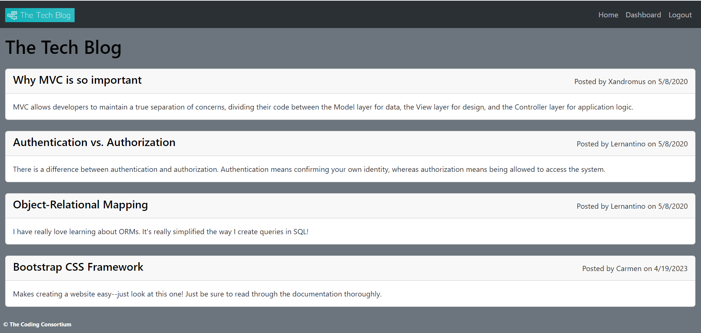
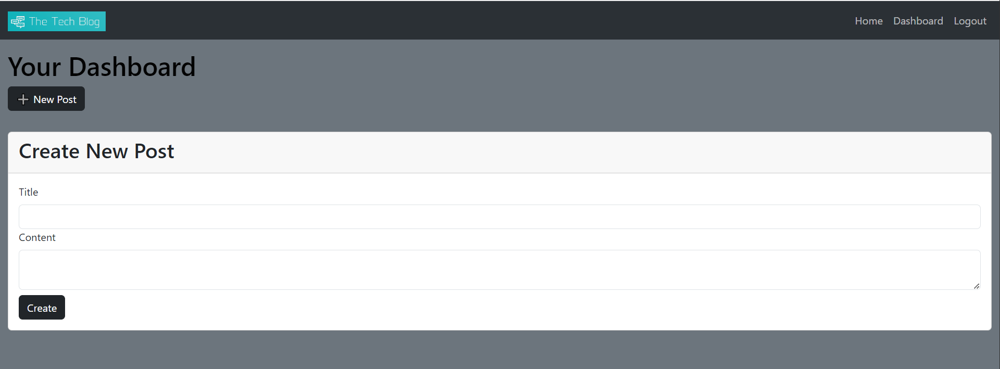
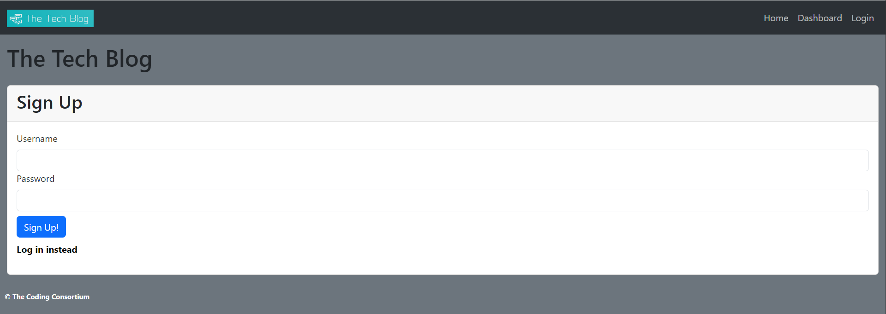
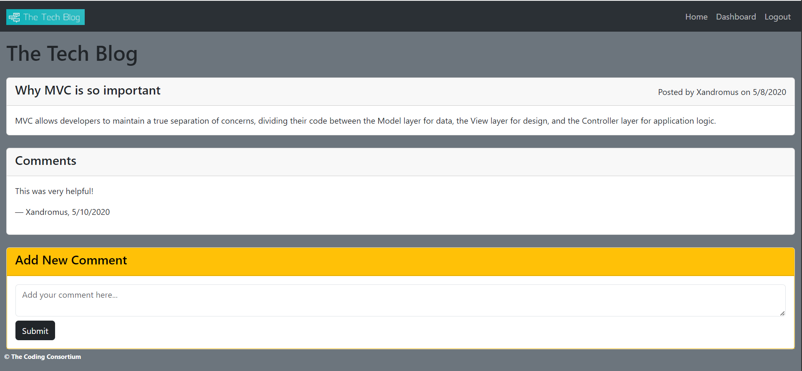

# cms-tech-blog
A CMS-style blog site similar to a Wordpress site, where developers can publish their blog posts and comment on other developers’ posts as well.

## User Story
AS A developer who writes about tech
I WANT a CMS-style blog site
SO THAT I can publish articles, blog posts, and my thoughts and opinions

## Link to Deployed App
[The Tech Blog](https://infinite-woodland-21056.herokuapp.com/)

## Site Functionality
* All pages include nav bar with links to the home page, dashboard page, and login/signup page
  * If the visitor is already signed in, the nav bar will instead have a logout link option
  * If the visitor is not signed in, the dashboard page redirects to the login page
  * Clicking on either the logo or the Home link will return the user to the home page
* After signing up or logging in, user credentials are saved; the user is automatically logged out after a set amount of time
* The home page displays all existing blog posts, including the post creator's username and the date the post was created
  * Clicking on a post title opens a new page that only displays that single post
  * On the single post page, a logged in user is able to leave a comment on the post
  * Comments include the comment creator's name and the date the comment was created
* The dashboard page displays all posts created by the signed-in user
  * Clicking the New Post button allows the user to create a new post, which will appear on both the dashboard and the home page once created
  * Clicking on the title of a created post allows the user to edit the post

## Screenshots

## License
This project is licensed under the MIT License - see the LICENSE.md file for details.

# NPM Packages Utilized
- [Sequelize](https://www.npmjs.com/package/sequelize)
- [Dotenv](https://www.npmjs.com/package/dotenv)
- [MySQL2](https://www.npmjs.com/package/mysql)
- [bcrypt](https://www.npmjs.com/package/bcrypt)
- [Express](https://www.npmjs.com/package/express)
- [Express-Session](https://www.npmjs.com/package/express-session)
- [Connect-Session-Sequelize](https://www.npmjs.com/package/connect-session-sequelize)
- [Express-Handlebars](https://www.npmjs.com/package/express-handlebars)